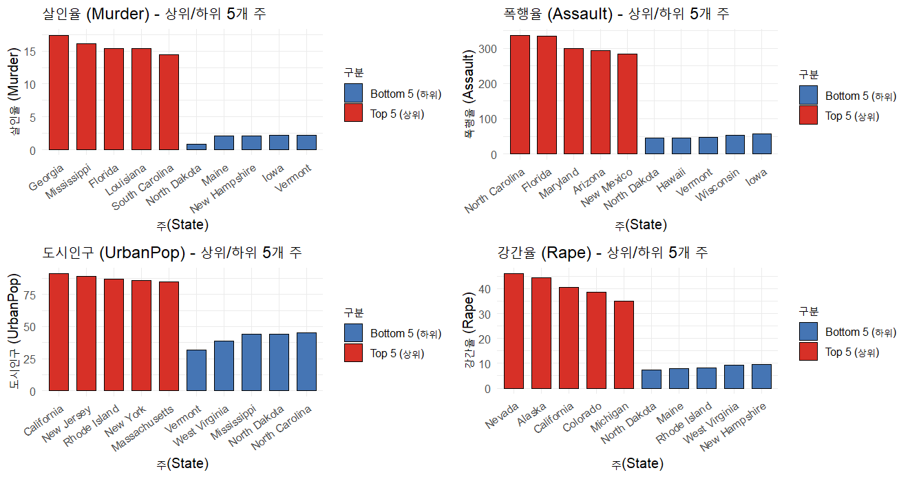

# 🗺️ 미국 범죄율 공간 분석 및 시각화 (R)

> R 내장 데이터셋 `USArrests`를 활용한 공간 데이터 시각화 및 통계 분석 프로젝트입니다.  
> **공간 데이터 처리, 지도 기반 시각화, 탐색적 데이터 분석(EDA)** 역량을 보여주며,  
> GIS 기반 플랫폼 및 AI 공간정보 서비스 개발에 직접적으로 적용 가능한 기술들을 다룹니다.

---

## 📌 프로젝트 개요

`USArrests` 데이터셋(1973년 미국 주별 범죄 통계)을 대상으로 세 가지 분석을 수행합니다:

| # | 과제 | 주요 기술 |
|---|------|----------|
| 1 | 살인율 단계구분도 (6단계 그라데이션 + 주 이름 레이블) | `ggplot2`, `maps`, 공간 조인 |
| 2 | 폭행율 분류 지도 (전국 중간값 초과/이하 구분) | 이진 공간 색상 분류 |
| 3 | 범죄 변수별 상위 5 / 하위 5개 주 — 막대그래프 + 분석 | `dplyr`, `gridExtra`, EDA |

---

## 🛠️ 사용 기술

- **언어:** R
- **라이브러리:** `ggplot2`, `maps`, `dplyr`, `gridExtra`
- **핵심 역량:** 공간 데이터 시각화, 단계구분도 작성, 통계 분석, 데이터 전처리

---

## 📊 시각화 결과

### 1. 주별 살인율 단계구분도 (Choropleth Map)
- 색이 진할수록 살인율이 높음
- 6단계 연속 색상 그라데이션 적용
- 주 경계선 및 이름 레이블 표시
- 

### 2. 폭행율 — 전국 중간값 초과 vs. 이하
- 🔴 빨간색: 전국 폭행율 중간값을 초과하는 주
- 🔵 파란색: 전국 폭행율 중간값 이하인 주
- 

### 3. 범죄 변수별 상위 5 / 하위 5개 주
- 분석 변수: `Murder`(살인), `Assault`(폭행), `UrbanPop`(도시인구), `Rape`(강간)
- 가독성을 위한 가로 막대그래프 사용
- 지역별 패턴 요약 분석 포함
- 

---

## 🔍 주요 분석 결과

- **남부 주** (조지아, 미시시피, 루이지애나 등)는 폭력 범죄(살인·폭행)에서 일관되게 상위권에 위치
- **농촌·저밀도 주** (노스다코타, 버몬트, 메인 등)는 폭력 범죄율이 가장 낮음
- **도시화율이 높다고 범죄율이 반드시 높지는 않음** — 예: 캘리포니아는 도시인구 비율은 높지만 모든 범죄 지표에서 상위권은 아님
- **강간율 지역 패턴**은 살인·폭행과 다르게 나타나며, 별도의 사회경제적 요인이 작용하는 것으로 분석됨 (예: 알래스카, 네바다)

---

## 💡 공간 AI 및 GIS 개발과의 연관성

이 프로젝트는 다음 분야의 실무 역량을 반영합니다:
- **공간 데이터 조인 및 렌더링** (GIS 레이어 처리와 유사)
- **단계구분도 생성** (드론 측량, 토지 모니터링 플랫폼에 활용)
- **통계 기반 임계값 설정 및 분류** (객체 탐지 알고리즘의 기초)
- **다변수 EDA 시각화** (AI 모델 검증 및 결과 보고에 필수)

---

## 🚀 실행 방법
```r
# 필요 패키지 설치 (최초 1회)
install.packages(c("ggplot2", "maps", "dplyr", "gridExtra"))

# 스크립트 실행
source("USArrests_analysis.R")
```

---

## 📁 파일 구조
```
USArrests_analysis/
│
├── Crime-Rate-GeoSpatial-Visualization.R
├── README.md
└── images/
    ├── plot_murder_map.png
    ├── plot_assault_median_map.png
    └── plot_top_bottom_bars.png
```

---

*공간정보 AI 및 GIS 소프트웨어 개발 직무를 목표로 한 데이터 시각화 포트폴리오의 일환으로 작성되었습니다.*
